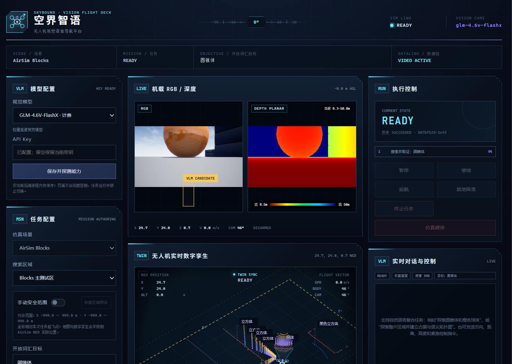
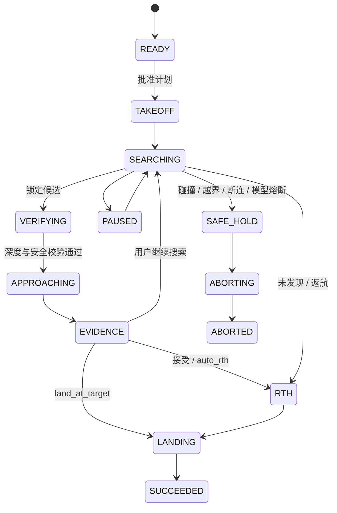
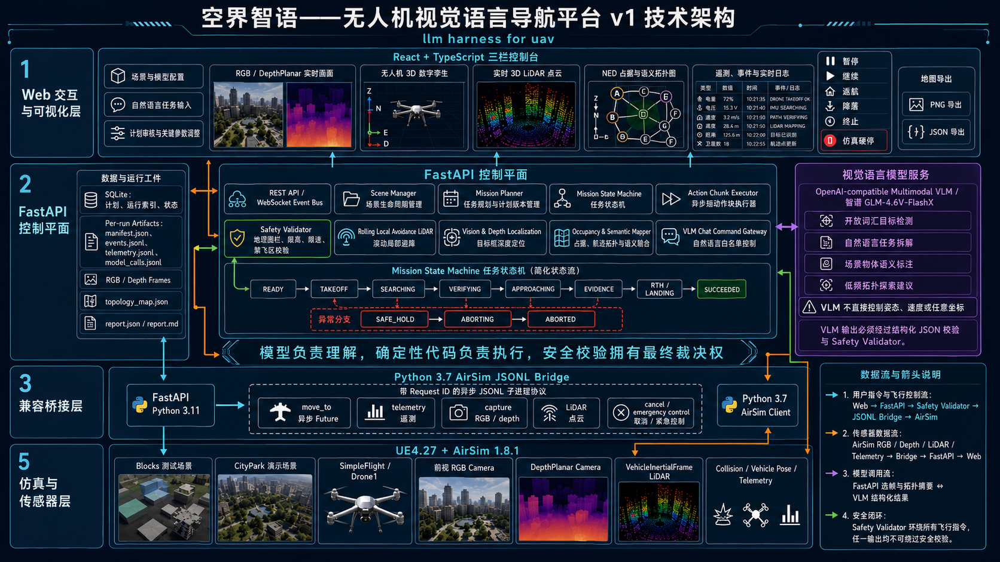
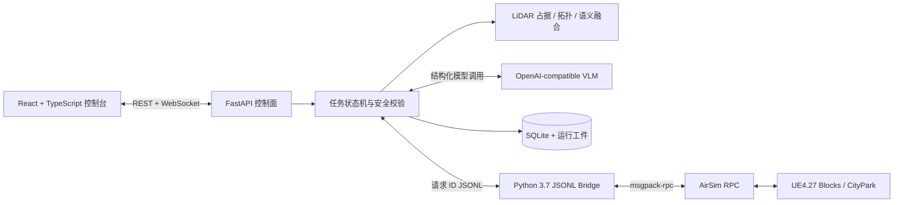

# 空界智语——无人机视觉语言导航 v1

基于 **UE4.27、AirSim 1.8.1、FastAPI、React 和视觉语言模型（VLM）** 的本地无人机视觉语言导航与任务控制平台。

本项目将大模型限制在任务语义解析、开放词汇视觉识别和局部探索建议范围内；航线生成、NED 坐标变换、深度定位、地理围栏、避障、飞行控制和故障恢复由确定性代码执行。首版面向 Windows 本地环境、单用户、单架 `SimpleFlight` 无人机，已经接入 Blocks、CityPark 和无需 UE 的 Mock E2E 场景。

> 当前版本：`v0.1.0` / “空界智语——无人机视觉语言导航 v1”
> 当前定位：可运行的研究原型与自动化 harness，不应直接用于真机或安全关键场景。

## 项目预览

<p align="center">
  
</p>

<p align="center"><em>三栏 Web 控制台：VLM 配置、任务审核、RGB/深度、数字孪生、实时点云、语义拓扑与安全控制。</em></p>

## 目录

- [项目预览](#项目预览)
- [核心能力](#核心能力)
- [设计边界](#设计边界)
- [系统要求](#系统要求)
- [快速开始](#快速开始)
- [真实 UE 与 AirSim 场景](#真实-ue-与-airsim-场景)
- [Web 控制台使用方法](#web-控制台使用方法)
- [任务与飞行逻辑](#任务与飞行逻辑)
- [建图、拓扑与数字孪生](#建图拓扑与数字孪生)
- [工程架构](#工程架构)
- [配置说明](#配置说明)
- [REST 与 WebSocket 接口](#rest-与-websocket-接口)
- [运行工件与复现](#运行工件与复现)
- [测试](#测试)
- [常见问题](#常见问题)
- [v1 已知限制与后续方向](#v1-已知限制与后续方向)

## 核心能力

### 场景与运行托管

- 通过 `configs/scenes.json` 白名单托管 Mock、Blocks 和 CityPark。
- 使用 `UE4Editor.exe <uproject> -game -settings=<repo-config>` 启动真实场景，不覆盖用户全局 AirSim `settings.json`。
- 场景启动前执行 VLM 视觉和结构化输出能力探测；AirSim RPC 就绪后才允许规划与起飞。
- 同一时刻只托管一个场景；正常停止会先检查活动任务，仿真硬停会终止 UE 并将任务标记为失败。
- 每次运行记录 UE、AirSim、Git 提交和场景文件 SHA-256 指纹。

### 自然语言与多目标任务

- 在 VLM 对话框中输入自然语言，可拆解为严格校验的任务计划。
- 支持单目标开放词汇搜索，例如“寻找橙色球体”。
- 支持有序多目标搜索，例如“先寻找橙色球体，再寻找圆锥体”。
- 支持区域语义建图，例如“探索整片区域并建立占据与语义拓扑图”。
- 所有自然语言任务只生成待审核计划，不能绕过人工批准流程。
- 活动任务中可通过对话发送白名单控制：方向/距离探索、相对或绝对高度调整、暂停、继续、返航、降落和终止。

### 视觉导航与飞行控制

- 首轮原地偏航环视，VLM 发现有效目标框后立即锁定。
- 环视未发现目标时，确定性覆盖航线与连续视觉 VLM 异步运行。
- Action Chunk 使用短距离分段飞行；视觉线程发现目标后可立即取消当前搜索航段。
- 使用对应 `DepthPlanar`、相机 FOV 和相机位姿将目标框定位到世界 NED。
- 接近过程中持续调用 VLM 更新目标锁定，飞控航向对准目标并保持安全接近距离。
- 支持 `review_then_rth`、`auto_rth` 和 `land_at_target` 三种结束策略。
- 低置信度、无有效深度、画面边缘截断、越界或危险坐标跳变不会触发接近。

### 安全、避障与恢复

- 每条飞行命令均经过任务状态、地理围栏、限高、限速、禁飞区和场景硬上限校验。
- Web 端可拖拽或输入任务级 NED 安全范围；审核后固化到不可变计划和运行清单。
- 使用 `VehicleInertialFrame` LiDAR 点云检测飞行走廊障碍。
- 滚动局部规划器在每个短航段重新扫描，可执行水平或垂直绕障并保留有限航向迟滞。
- 碰撞、遥测过期、模拟器退出、越界或连续模型失败进入 `SAFE_HOLD` / `ABORTING`。
- 暂停、继续、返航、就地降落、终止任务和仿真硬停不依赖模型响应。

### 实时 Web 控制台

- 保持三栏科技风控制台布局。
- 实时 RGB、伪彩色深度图和目标框。
- NED 俯视占据与语义拓扑图，箭头按相机航向显示。
- 可交互的无人机三维数字孪生，显示机体姿态、安全边界、航迹、语义物体、占据点和实时 3D LiDAR 点云。
- 任务计划审核面板支持自定义搜索高度、航带间距、速度、接近距离、净空和时限等关键参数。
- 实时遥测、任务状态、事件时间线和分级日志。
- 地图可导出为 PNG；地图、航迹、安全边界、车辆状态与语义数据可导出为版本化 JSON。

### 数据与回放

- SQLite 保存计划、运行索引和状态。
- 每次运行使用独立目录保存清单、事件、遥测、模型调用、RGB 帧、压缩深度帧、证据和最终报告。
- WebSocket 实时预览中的 Base64 图像不会重复写入 `events.jsonl`，事件仅保存帧引用。
- 运行结束写出完整 `topology_map.json`、`report.json` 和 `report.md`。

## 设计边界

本项目采用“模型负责理解，代码负责执行”的边界：

| 能力 | VLM | 确定性代码 |
| --- | --- | --- |
| 自然语言任务拆解 | 是 | 校验并生成不可变计划 |
| 开放词汇目标识别 | 是 | 置信度、框、深度和地理围栏校验 |
| 语义物体标签 | 是 | 深度定位、去重与拓扑融合 |
| 覆盖航线 | 提供有限局部建议 | 生成并执行连续割草航线 |
| 实时姿态/速度控制 | 否 | AirSim 飞控适配器 |
| 障碍物判定 | 否 | LiDAR 走廊检测与局部规划 |
| 安全范围和限高 | 否 | 每段强制验证 |
| 暂停、返航、降落、硬停 | 否 | 独立控制路径 |

平台不会执行模型生成的任意程序、任意 RPC 方法或未经校验的世界坐标。

## 系统要求

### Mock 模式最低要求

- Windows 10/11 与 PowerShell 5.1 或更高版本。
- Miniconda 或 Anaconda，`conda` 已加入 PATH。
- 能创建 Python 3.11 / Node 20 Conda 环境。

### 真实 AirSim 模式额外要求

- Unreal Engine `4.27.2`。
- AirSim `1.8.1` 源码与已编译 UE 插件。
- Visual Studio 2022 与 UE4.27 C++ 编译工具链。
- 一个可运行 AirSim Python 客户端的 Python 3.7 Conda 环境，默认名为 `airsim`。
- Blocks 和/或 CityPark 工程。
- AirSim RPC 默认监听 `127.0.0.1:41451`。

本仓库不包含 UE、AirSim 源码、场景资产或编译产物，需要在本机单独安装。

## 快速开始

### 1. 安装控制面依赖

在仓库根目录执行：

```powershell
Set-ExecutionPolicy -Scope Process Bypass
.\scripts\bootstrap.ps1
```

脚本会：

1. 创建 `llm-harness` Conda 环境；
2. 安装 Python 3.11 后端和测试依赖；
3. 在同一环境中安装 Node 20；
4. 安装前端依赖。

### 2. 创建本地配置

```powershell
Copy-Item .env.example .env
```

第一次建议保留 Mock Provider：

```dotenv
HARNESS_PROVIDER=mock
```

`.env` 已被 `.gitignore` 排除，禁止提交 API Key。

### 3. 启动平台

```powershell
.\scripts\dev.ps1
```

`dev.ps1` 会先构建 React 前端，再由 FastAPI 在同一个地址提供 API、WebSocket 和静态页面：

```text
http://127.0.0.1:8000/
```

健康检查：

```powershell
Invoke-RestMethod http://127.0.0.1:8000/api/health
```

### 4. 无 UE 验证完整流程

1. 在“模型配置”中保留 Mock Provider。
2. 在“任务配置”选择 `Mock E2E（无需 UE）`。
3. 点击启动场景。
4. 输入开放词汇目标，生成计划。
5. 在“计划审核”检查并应用参数。
6. 批准并执行任务。
7. 观察 RGB/深度、数字孪生、拓扑地图、日志和运行状态。

Mock 用于 UI/API/状态机自动测试，不代表真实视觉识别效果。

## 真实 UE 与 AirSim 场景

### 修改本机路径

`configs/scenes.json` 中的以下字段是机器相关路径，首次运行前必须修改：

- `executable`：`UE4Editor.exe` 路径；
- `project`：场景 `.uproject` 路径；
- `map`：可选的 UE 地图与 GameMode；
- `settings`：本仓库 AirSim runtime settings 的绝对路径；
- `checksum_paths`：用于复现指纹的地图/资产路径；
- `bridge_conda_env`：安装 AirSim Python 包的隔离环境名。

示例：

```json
{
  "id": "blocks",
  "mode": "editor",
  "executable": "D:\\UE_4.27\\Engine\\Binaries\\Win64\\UE4Editor.exe",
  "project": "E:\\C\\AirSim\\Unreal\\Environments\\Blocks\\Blocks.uproject",
  "settings": "C:\\path\\to\\airsim-llm-harness\\configs\\airsim\\blocks.settings.json",
  "vehicle_name": "Drone1",
  "bridge_conda_env": "airsim"
}
```

### AirSim 配置

- Blocks：`configs/airsim/blocks.settings.json`
- CityPark：`configs/airsim/citypark.settings.json`

配置中提供 `SimpleFlight`、前视相机、RGB、`DepthPlanar` 和 `VehicleInertialFrame` LiDAR。平台使用 `-settings=<path>` 注入配置，不修改用户目录中的全局设置。

### Fixture 插件

`ue-plugins/DroneHarnessFixtures` 是仅用于 E2E 的 UE 插件，可生成颜色和形状可描述的测试物体。Blocks 默认通过 `-HarnessFixture` 启用；正式任务不依赖该插件。

部署插件后需要使用 UE4.27/VS2022 重新生成工程文件并编译目标场景。插件副本应位于对应 UE 工程的 `Plugins/DroneHarnessFixtures`。

### Blocks 冒烟测试

先启动后端，然后执行：

```powershell
conda run -n llm-harness python scripts/smoke_blocks.py
```

脚本会经控制面启动 Blocks、等待 RPC 就绪，并完成起飞、悬停、RGB/深度取图、LiDAR 校验、降落和场景关闭。它不依赖视觉模型。

### CityPark 注意事项

- 当前配置使用 `/Game/CityPark/Maps/Showcase?game=/Script/AirSim.AirSimGameMode`。
- 若初始点位于水体、地面穿插或深度无效区域，应先确认 AirSim PlayerStart 和地图碰撞，再起飞测试。
- 深度预览会检测常量/无效 `DepthPlanar`；无法形成可靠距离分布时显示诊断状态，而不是整幅红色图。
- 当前开发机曾修复 CityPark `.uproject` JSON 和 `AirSim` 模块大小写；仓库不包含该外部工程文件。

## VLM 配置

### Mock Provider

```dotenv
HARNESS_PROVIDER=mock
```

不需要 API Key，适合自动测试、前端开发和状态机验证。

### OpenAI-compatible 多模态 Provider

```dotenv
HARNESS_PROVIDER=openai-compatible
LLM_BASE_URL=https://your-provider.example/v1
LLM_MODEL=your-vision-model
LLM_API_KEY=replace-me
LLM_TIMEOUT_SECONDS=60
```

接口采用 OpenAI-compatible Chat Completions 语义，但服务必须同时支持：

- 图像输入；
- JSON 对象输出；
- 本项目定义的 `DetectionAssessment`；
- 项目使用的模型上下文长度和图像大小。

### 智谱示例

```dotenv
HARNESS_PROVIDER=openai-compatible
LLM_BASE_URL=https://open.bigmodel.cn/api/paas/v4
LLM_MODEL=glm-4.6v-flashx
LLM_API_KEY=replace-me
```

也可以在 Web“模型配置”中选择受控模型并输入 API Key。Web 配置流程具有以下约束：

- 新模型会先完成视觉和 JSON 能力探测；
- 探测失败时保留原 Provider；
- API Key 只保存在当前后端进程内存；
- API 不回显密钥，浏览器不写入 `localStorage`；
- 后端重启后需要重新输入，或由未提交的 `.env` 提供。

智谱模型的免费/计费状态和限流策略可能变化，应以智谱控制台为准。遇到 HTTP 429 时，适配器会根据 `Retry-After` 或指数退避重试，连续失败仍会安全熔断。

## Web 控制台使用方法

### 标准目标搜索

1. 配置并探测 VLM。
2. 选择场景，启动模拟器。
3. 选择搜索区域。
4. 可选：开启“手动安全范围”，在地图拖拽矩形或填写 NED 数值。
5. 输入目标，如“橙色球体”或“圆锥体”。
6. 生成计划。
7. 在“计划审核”修改关键参数并点击应用。
8. 批准计划；批准前无人机不能起飞。
9. 通过实时画面、数字孪生、地图、遥测和日志监督任务。
10. 在证据审核阶段接受目标或继续搜索。

### 多目标任务

在“实时对话与控制”输入：

```text
先探索橙色球体，到达后再搜索圆锥体
```

开启“允许 VLM 执行白名单控制”后发送。系统会生成多个有序 `MissionTask`，但不会立即起飞；仍需在计划审核区确认并批准。

### 区域语义建图

输入：

```text
探索整片区域，建立给定区域的占据与语义拓扑图
```

系统生成 `semantic_mapping` 任务，使用确定性覆盖路线累计 LiDAR、RGB、深度和语义物体。当区域覆盖达到计划目标或路线完成后，自动返航并生成地图工件。

### 活动任务中的自然语言控制

示例：

```text
向北探索 10 米
向右前方飞 8 米
提升高度 3 米
飞到离地 12 米
暂停任务
继续
立即返航
就地降落
终止任务
```

方向基于 NED 和当前相机/机体上下文转换。模型只能生成白名单动作，实际目标点仍经过地理围栏、限高、障碍物和任务状态校验。

### 紧急控制语义

| 控制 | 行为 |
| --- | --- |
| 暂停 | 取消当前分段命令并悬停 |
| 继续 | 从任务状态机恢复 |
| 返航 | 终止搜索，按安全路径回到本次起飞点 |
| 就地降落 | 在当前位置执行降落 |
| 终止任务 | 进入中止流程并安全收尾 |
| 仿真硬停 | 立即停止 UE/桥进程，仅用于仿真故障 |

## 任务与飞行逻辑

### 状态机



终态包括 `SUCCEEDED`、`ABORTED`、`FAILED` 和 `NOT_FOUND`。

### 初始环视

场景可通过 `initial_panorama_yaws_deg` 配置一组绝对偏航角。无人机依次旋转并取图：

1. VLM 输出目标匹配、置信度和归一化框；
2. 代码检查置信度、框完整性和深度；
3. 将框内中值深度投影为世界 NED；
4. 验证目标位于搜索区/安全范围内；
5. 通过后立即进入接近，不要求先执行横移第二视角。

### 环视未发现目标后的搜索

- 规划器生成连续 boustrophedon（割草式）覆盖航线。
- 飞控将长航段拆成受限 Action Chunk。
- 后台 `_stream_vlm_search` 在飞行过程中连续取图和识别，不插入悬停。
- LiDAR 在每个分段前检查走廊，并根据局部点云滚动绕障。
- 已被 LiDAR 覆盖的目标航点可被动态跳过。
- 一旦视觉线程建立可靠锁定，当前飞行命令被取消并转入接近。

### 拓扑 VLM 当前调用机制

拓扑 VLM 与连续视觉 VLM 是两条不同链路：

- **视觉 VLM**：飞行中持续调用，负责检测目标和语义物体；
- **拓扑 VLM**：搜索开始时调用一次，人工方向/距离或高度指令改变视点后可再次调用。

拓扑规划输入包含最近拓扑节点/边、地图统计和连续覆盖路线前方最多 8 个候选航点。候选携带 `coverage_ratio`、`explored`、`novelty_m`、相邻关系和目标语义线索距离。

v1 为避免模型将远距离扫描带重新排序造成跨图跳转，拓扑 VLM 只能在连续局部前视窗口内建议目标，确定性代码仍返回原覆盖路线。因此它目前主要用于局部建议和日志解释，并未形成持续的全局前沿重规划闭环。详见[已知限制](#v1-已知限制与后续方向)。

### 目标接近

- 接近航向持续对准目标位置。
- 视觉 VLM 在运动中继续更新目标框与深度位置。
- 位置更新经过平滑和最大跳变限制，避免单帧噪声直接改变飞行方向。
- 预期障碍遮挡可暂时保留最后稳定锁定；无合理遮挡的连续目标丢失或危险跳变会触发安全停止。
- 接近点由最小安全距离和地理围栏共同决定。

### 坐标约定

AirSim 使用 NED：

- `+X`：North / 北；
- `+Y`：East / 东；
- `+Z`：Down / 向下；
- 飞行高度为 `home.z - position.z`；
- 任务安全范围以本次起飞点为局部原点；
- 地图和数字孪生会平移到实际 AirSim NED `home_position`。

## 建图、拓扑与数字孪生

### LiDAR 占据与探索层

- 输入必须为 `VehicleInertialFrame` 世界 NED 点云。
- 射线经过的网格记为已探索自由空间，末端稳定命中形成 2.5D 占据点。
- 默认探索网格大小为 2 米。
- 占据点需要重复证据以抑制孤立噪声。
- 搜索航点周围 LiDAR 覆盖率达到阈值后可被认为已探索。

### 航迹拓扑

- 飞行路径被抽样为 `place` 节点并按访问顺序连接。
- 拓扑图在同一模拟器场景会话中持续积累，可支持后续任务跳过部分已探索航点。
- 运行结束时完整快照写入 `topology_map.json`。

### VLM 语义地标

- VLM 可随检测结果返回有限语义物体清单。
- 每个物体框使用对应深度定位到 NED。
- 同类别、空间相近的多帧观测进行滤波与合并，减少重复标注。
- 语义地标不是碰撞证据；避障只信任 LiDAR 和确定性安全几何。

### 实时数字孪生

中栏 Canvas 数字孪生显示：

- 按 AirSim 四元数驱动的无人机姿态；
- 相机/机体方向；
- 任务安全边界和高度围栏；
- 实时与近期 LiDAR 3D 点云；
- 占据点、语义物体和历史航迹；
- NED North/East 方向。

渲染循环与 React 高频遥测更新解耦，避免每帧重建 Canvas 导致频闪。可以拖拽调整观察视角。

### 地图导出

地图面板提供：

- `PNG`：导出当前 SVG 地图渲染；
- `JSON`：导出 `airsim-llm-harness.semantic-map.v1`，包括场景、区域、任务、车辆、完整轨迹、安全范围和语义地图。

浏览器导出是当前实时视图快照；任务结束后的服务端权威快照位于运行目录的 `topology_map.json`。

## 工程架构

<p align="center">
  
</p>

<p align="center"><em>v1 总体技术架构：Web 可视化、FastAPI 控制平面、VLM 服务、Python 3.7 JSONL 兼容桥和 UE4.27/AirSim 仿真层。</em></p>

### 运行组件与数据流



### 组件职责

| 路径 | 职责 |
| --- | --- |
| `backend/harness/app.py` | FastAPI 生命周期、REST、WebSocket、Provider 热配置、静态前端 |
| `backend/harness/mission.py` | 任务批准、状态机、搜索、接近、控制与故障恢复 |
| `backend/harness/planner.py` | 覆盖航线、计划参数、任务拆解后的确定性计划 |
| `backend/harness/safety.py` | NED 地理围栏、限高、禁飞区和安全包线 |
| `backend/harness/avoidance.py` | LiDAR 走廊检测和滚动局部绕障 |
| `backend/harness/geometry.py` | 深度预览、目标框投影、相机与 NED 几何 |
| `backend/harness/mapping.py` | 探索网格、占据点、航迹拓扑和语义地标合并 |
| `backend/harness/llm.py` | Mock / OpenAI-compatible 视觉、对话和拓扑规划适配器 |
| `backend/harness/simulator.py` | UE 场景生命周期、健康检查、实时预览与冒烟流程 |
| `backend/harness/bridge.py` | 控制面侧 JSONL 子进程客户端 |
| `bridge/airsim_bridge.py` | Python 3.7 AirSim RPC 隔离桥 |
| `backend/harness/store.py` | SQLite、JSONL、帧、地图、清单和报告持久化 |
| `frontend/src/App.tsx` | 三栏控制台、任务审核、日志、VLM 对话和地图导出 |
| `frontend/src/MapView.tsx` | 自适应 NED 占据与语义拓扑图 |
| `frontend/src/DigitalTwinView.tsx` | 实时 3D 数字孪生和点云渲染 |
| `configs/` | 场景白名单、AirSim runtime settings、环境基线 |
| `ue-plugins/DroneHarnessFixtures/` | E2E 合成目标插件源码 |
| `tests/` | 后端单元、API、规划、安全与集成测试 |

### JSONL Bridge

现代后端与 AirSim Python 3.7 客户端使用一行一个 JSON 对象的子进程协议：

- 每个请求包含唯一请求 ID；
- `move_to` 等飞行 Future 在桥内部异步等待；
- 主 JSONL 循环仍可响应遥测、取图、LiDAR 和紧急取消；
- 控制面不会因 AirSim 旧依赖而降级到 Python 3.7；
- 桥断开被视为安全故障。

### 仓库结构

```text
airsim-llm-harness/
├── backend/harness/          # FastAPI 控制面与核心任务逻辑
├── bridge/                   # Python 3.7 AirSim JSONL Bridge
├── configs/
│   ├── airsim/               # Blocks / CityPark 独立 settings
│   ├── scenes.json           # 场景白名单、安全区和启动参数
│   └── environment-baseline.json
├── frontend/                 # React + TypeScript + Vite
├── scripts/                  # bootstrap、dev、Blocks smoke
├── tests/                    # Python 测试
├── ue-plugins/               # UE E2E fixture 插件源码
├── data/                     # SQLite，已忽略
├── runs/                     # 每次运行工件，已忽略
├── .env.example
└── pyproject.toml
```

## 配置说明

### 后端环境变量

| 变量 | 默认值 | 说明 |
| --- | --- | --- |
| `HARNESS_HOST` | `127.0.0.1` | 本地监听地址 |
| `HARNESS_PORT` | `8000` | HTTP / WebSocket 端口 |
| `HARNESS_SCENES_FILE` | `configs/scenes.json` | 场景白名单 |
| `HARNESS_DATA_DIR` | `data` | SQLite 数据目录 |
| `HARNESS_RUNS_DIR` | `runs` | 运行工件目录 |
| `HARNESS_AIRSIM_CONDA_ENV` | `airsim` | 默认桥环境 |
| `HARNESS_PROVIDER` | `mock` | `mock` 或 `openai-compatible` |
| `LLM_BASE_URL` | 空 | OpenAI-compatible API 根地址 |
| `LLM_MODEL` | 空 | 模型名 |
| `LLM_API_KEY` | 空 | 仅后端读取的密钥 |
| `LLM_TIMEOUT_SECONDS` | `60` | 单次模型请求超时 |

### 场景配置核心字段

| 字段 | 说明 |
| --- | --- |
| `mode` | `mock`、`editor` 或 `packaged` |
| `manual_safety_bounds` | 场景允许的任务级安全范围硬上限 |
| `zones[].polygon` | 搜索和目标允许区域 |
| `zones[].coverage_polygon` | 可选的覆盖航线区域，可小于安全区 |
| `zones[].search_altitude_m` | 默认搜索高度 |
| `zones[].lane_spacing_m` | 覆盖航带间距 |
| `zones[].initial_panorama_yaws_deg` | 起飞后原地环视角度 |
| `safety.min/max_altitude_m` | 高度包线 |
| `safety.max_speed_mps` | 搜索最大速度 |
| `safety.approach_speed_mps` | 接近速度 |
| `safety.min_standoff_m` | 目标最小距离 |
| `safety.min_clearance_m` | LiDAR 最小净空 |
| `safety.max_mission_seconds` | 任务时限 |
| `safety.no_fly_zones` | NED 多边形禁飞区 |

计划审核允许较大的实验参数范围，但物理量仍必须为正值，而且最终值不能绕过场景硬上限和安全校验。

## REST 与 WebSocket 接口

### REST

| 方法 | 路径 | 说明 |
| --- | --- | --- |
| `GET` | `/api/health` | 后端、模拟器和 Provider 状态 |
| `GET` | `/api/scenes` | 场景白名单 |
| `GET` | `/api/simulator/diagnostics` | 桥 PID 与 stderr 尾部 |
| `POST` | `/api/simulator/start` | 探测模型并启动场景 |
| `POST` | `/api/simulator/stop` | 无活动任务时优雅停止 |
| `POST` | `/api/simulator/smoke` | 真实场景车辆冒烟测试 |
| `GET` | `/api/provider/config` | 获取脱敏 Provider 配置 |
| `PUT` | `/api/provider/config` | 热更新模型/API Key 并探测能力 |
| `POST` | `/api/provider/probe` | 手动能力探测 |
| `POST` | `/api/missions/plan` | 生成待审核计划 |
| `PATCH` | `/api/missions/{id}` | 基于版本号修改计划参数 |
| `POST` | `/api/missions/{id}/approve` | 批准不可变计划并创建运行 |
| `GET` | `/api/runs` | 运行列表 |
| `GET` | `/api/runs/{id}` | 运行详情 |
| `GET` | `/api/runs/{id}/artifacts` | 工件列表 |
| `GET` | `/api/runs/{id}/artifacts/{path}` | 安全下载单个工件 |
| `POST` | `/api/runs/{id}/candidate` | 接受候选或继续搜索 |
| `POST` | `/api/runs/{id}/{action}` | pause/resume/return-home/land/abort/hard-stop |
| `POST` | `/api/vlm/chat` | 自然语言任务与白名单飞行控制 |

### WebSocket

单一端点：

```text
ws://127.0.0.1:8000/api/ws
```

统一事件结构：

```json
{
  "topic": "telemetry",
  "run_id": "run-uuid",
  "sequence": 42,
  "timestamp": "2026-08-11T12:00:00Z",
  "payload": {}
}
```

连接后首先收到 `snapshot`，其中包含模拟器状态、最近运行、当前语义地图和最近 LiDAR。常用 topic：

- `run.created`、`run.state`、`run.control`；
- `telemetry`、`frame.preview`、`lidar.points`；
- `vision.assessment`、`vision.locked`、`vision.rejected`；
- `search.action_chunk`、`search.waypoint_skipped`、`search.topology_vlm_plan`；
- `avoidance.scan`、`avoidance.detour`、`avoidance.recovery`；
- `map.semantic`、`map.update`；
- `model.error`、`vlm.chat`。

## 运行工件与复现

每个任务目录位于：

```text
runs/<run-id>/
```

典型内容：

```text
manifest.json             # 计划、安全范围、Git/UE/AirSim/场景指纹
events.jsonl              # 状态、日志、视觉、避障和地图事件
telemetry.jsonl           # 时间序列 NED 遥测
model_calls.jsonl         # 脱敏模型请求元数据与结构化响应
frames/*.png              # VLM 观察 RGB
frames/*.depth.zlib       # 对应 float32 深度
frames/*.json             # 相机位姿、FOV 与帧元数据
evidence/*                # 最终取证帧与深度
topology_map.json         # 最终占据、拓扑、语义与统计
report.json               # 机器可读结果
report.md                 # 人类可读报告
```

API Key 不会写入以上文件。发布代码前也应检查 `.env`、`runs/`、`data/` 和日志未进入 Git。

## 测试

### 后端

```powershell
conda run -n llm-harness pytest
```

测试覆盖：

- NED 几何、目标框深度定位和深度预览；
- 覆盖航线、手动安全范围和计划版本；
- LiDAR 走廊、局部绕障、航向迟滞和循环抑制；
- 占据网格、射线自由空间、拓扑与语义去重；
- Mock / 智谱兼容请求、JSON 校验、429 退避和 VLM 对话；
- API Key 不回显、不持久化；
- 多目标搜索、区域建图、异步搜索、目标接近与结束策略；
- 低置信度、无深度、碰撞、越界、断连和模型熔断。

### 前端

```powershell
$harnessEnv = conda env list --json |
  ConvertFrom-Json |
  Select-Object -ExpandProperty envs |
  Where-Object { $_ -match '[\\/]envs[\\/]llm-harness$' } |
  Select-Object -First 1

$env:PATH = "$harnessEnv;$env:PATH"
Push-Location frontend
try {
  npm test -- --run
  npm run build
} finally {
  Pop-Location
}
```

前端测试覆盖安全范围坐标转换、自适应地图、相机方向箭头、语义/占据渲染、NED 到数字孪生坐标变换、机体航向和高频遥测下的单一渲染循环。

## 常见问题

### 重启电脑后网页显示 `Failed to fetch`

`127.0.0.1:8000` 只是本地进程地址，重启后后端不会自动运行。重新执行：

```powershell
.\scripts\dev.ps1
```

如果端口仍不可用，检查：

```powershell
Get-NetTCPConnection -LocalPort 8000 -ErrorAction SilentlyContinue
Invoke-RestMethod http://127.0.0.1:8000/api/health
```

### 页面没有实时 RGB 或深度

1. 确认场景状态为 `READY` 或任务正在运行；
2. 查看 `/api/simulator/diagnostics`；
3. 检查 AirSim 车辆名和相机配置；
4. 确认前端 WebSocket `/api/ws` 已连接；
5. CityPark 起飞后再判断水面/出生点造成的无效深度；
6. 查看实时日志中的 `frame.preview`、`model.error` 和桥 stderr。

### 智谱返回 HTTP 429

- 降低视觉采样频率或改用限额更高的模型；
- 检查账号并发和速率限制；
- 等待 `Retry-After`；
- 避免同时从多个后端进程使用同一个 Key；
- 自动重试失败三次后，任务会安全熔断，而不是盲飞。

### 无人机在已探索区域重复飞行

v1 的“已探索”主要用于跳过目标航点，不对航点之间的完整连接段计算全局历史重访代价。局部避障器只有短期绕障记忆，恢复动作也可能穿过旧区域。详见下一节。

### 安全范围看起来没有生效

- 手动范围以本次运行 `home_position` 为原点，不是绝对世界零点；
- 修改后必须重新生成或修订计划并应用；
- 批准后的计划不可变，后续 UI 输入不会改变活动任务；
- 查看 `manifest.json` 中固化的安全范围以及地图中“硬上限/任务范围”两层边界；
- 实际遥测越界会进入 `SAFE_HOLD`。

## v1 已知限制与后续方向

### 已知限制

1. **拓扑 VLM 不是持续全局规划器。**当前仅在搜索开始和人工视点改变后低频调用；输出局部建议，但不重排确定性全局航线。
2. **已探索判定是航点级而不是航段级。**下一个航点未探索时，连接路径仍可能经过旧区域。
3. **局部避障缺少全局历史代价。**规划器使用当前 LiDAR 和少量近期绕障点，可能在障碍附近重复进入旧网格。
4. **割草覆盖本身存在正常相邻航带往返。**这与异常的局部回退需要在 UI 中进一步分层显示。
5. **语义地图依赖 VLM 标签和单帧深度。**复杂遮挡、反光、水体、纹理缺失和深度无效仍会影响定位。
6. **未接入真正的 EGO-Planner。**当前只是受其滚动局部重规划思想启发的轻量确定性实现。
7. **Windows 单机限定。**PX4 SITL、ROS、真机、多人权限、云部署、UE5/Project AirSim 和多机协同不在 v1 范围。
8. **场景路径目前是开发机配置。**其他机器必须修改 `configs/scenes.json`。

### 建议的下一阶段

- 将 LiDAR 探索网格、占据栅格和历史轨迹加入统一全局代价地图；
- 为候选航段计算已探索重叠率、信息增益、路径长度和安全净空；
- 在航点完成、航点阻塞或地图信息增益显著变化时低频触发拓扑 VLM；
- 用 A* / Dijkstra / kinodynamic planner 生成受安全约束的连接路径；
- 为刚访问网格增加时间冷却和重访惩罚；
- 限制非死锁情况下的大角度避障恢复；
- 在地图中区分计划航线、已提交 Action Chunk、局部避障轨迹和实际航迹；
- 增加完整 Fixture E2E：橙色球体和圆锥体连续任务的可重复真实 UE 回归。

## 安全与隐私

- 默认仅监听 `127.0.0.1`，没有身份认证，不应直接暴露到局域网或公网。
- `.env`、SQLite、运行工件、日志和 UE 大型资产均被 Git 忽略。
- API Key 仅从后端环境变量或 Web 临时输入读取，不回显、不写浏览器存储、不写运行报告。
- 模型请求记录必须保持脱敏；发布前应再次执行秘密扫描。
- `hard-stop` 只适用于仿真，不代表真实飞行器的急停机制。

## 外部工程与许可

- 仓库不包含 Microsoft AirSim、Epic Unreal Engine、Blocks/CityPark 场景资产或智谱模型服务。
- 使用这些外部组件时需分别遵守其许可证、服务条款和资产授权。
- 当前仓库尚未附带开源许可证；在添加明确的 `LICENSE` 前，默认不授予复制、修改或再分发许可。
